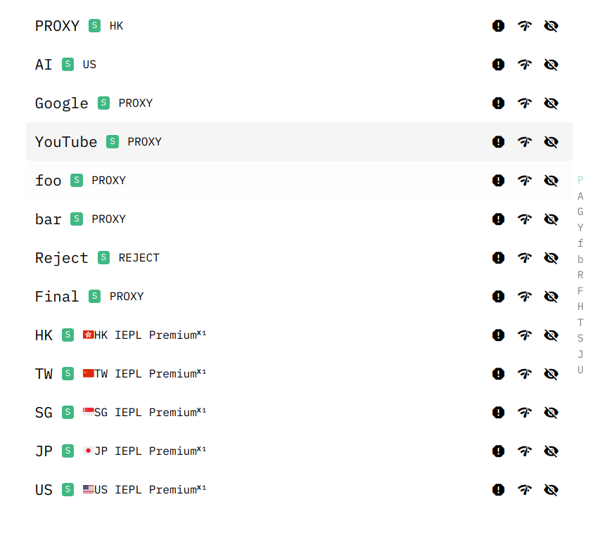

## 简介

这个项目是我个人使用 clash 的 parser 功能来帮助我自定义我的订阅文件的配置, 以及我正在使用的规则集. 其中规则集中的数据大部分来自于项目[@dler-io/Rules](https://github.com/dler-io/Rules). 有关 parser 的介绍请看[官方文档](https://docs.cfw.lbyczf.com/contents/parser.html#%E7%89%88%E6%9C%AC%E8%A6%81%E6%B1%82). 订阅链接经过 parser 处理后的结果可以参考 [parser_res.yaml](./parser_res.yaml).

## 如何使用

首先将我的 [parsers配置](./parsers/parsers.yaml) 复制到你的 clash 的 Parsers. 然后根据你的需求做自定义的修改.
根据你自己的情况修改文件路径. reg 的部分根据你的订阅链接做相应的修改. 你只要修改两个部分:

1. 每个file字段中的文件路径修改为在你设备上的实际的的文件路径.
2. 修改`# Add proxy-providers`部分, reg 字段为你的订阅链接的正则表达式, file 字段为你的 proxy-providers 的配置文件的路径. 具体使用参考 [proxy-providers配置](./proxy-provider-config.md). 没有这部分需求可以参考下面的文件按照提示在parsers中注释这部分.

### 配置 parsers

```yaml
parsers:
  # Prologue
  # Remove default configuration for all subscription link 
  # Add custom proxy-groups
  - reg: ^.*$
    file: "你的文件位置/parsers/prologue.js"

  # 如果没有 proxy-providers 的需求可以直接注释或者删除下面的部分
  # Add proxy-providers
  # - reg: wqatom
  #   file: "你的文件位置/parsers/proxy-providers/mix-proxy-providers.yaml"
  # - reg: wqatom
  #   file: "你的文件位置/parsers/NEX.yaml"
    
  # Group proxy by region
  - reg: ^.*$
    file: "你的文件位置/parsers/group-by-regions.js"
  # Configure the proxy group for each subscription link
  - reg: ^.*$
    file: "你的文件位置/parsers/add-proxies.js"

  # Epllogue
  # Add custom rules
  - reg: ^.*$
    file: "你的文件位置/parsers/rules.js"
  # Optimize the speed when downloading providers
  - reg: ^.*$
    file: "你的文件位置/parsers/download-providers-fast.js"
```

### 配置代理组

改好 parsers 的配置后, 修改`config`文件夹下的[proxy-groups-config.txt](./parsers/config/proxy-groups-config.txt), 根据你自身需求修改成你想要的分组情况(可以随意增加或者减少分组). 我给出一些示例:

比如你只需要`AI`, `Google`, `YouTube`, `foo`, `bar`这几个分组, 那么你的`proxy-groups-config.txt`应该为下面的情况. (在这个文件中不需要有Final和Reject分组, 默认会添加)

```txt
AI
Google
YouTube
foo
bar
```

### 配置自定义规则(可选)

在`config`文件夹下的[custom-rule.txt](./parsers/config/custom-rule.txt)中填入你的自定义规则, 语法参照 [clash 文档](https://dreamacro.github.io/clash/zh_CN/configuration/rules.html). 在我的自定义规则中, 有三条规则指向了`Scholar`分组, 你如果没有该分组应该修改这三条规则或者将他删除. 请确保你自定义规则中指向的分组存在.

```txt
DOMAIN-KEYWORD,deepl.com,Scholar
DOMAIN-KEYWORD,lingvanex,Scholar
DOMAIN-KEYWORD,leetcode.com,Scholar
```

### 配置规则集

接下来需要配置最重要的东西--规则集, 为了方便说明, 还是参照上面的代理组, 只有`AI`, `Google`, `Netflix`, `YouTube`, `foo`, `bar`这几个分组. 为了达到分流的目的, 我们需要指定哪些网站走哪些分组, 为了方便, 可以使用`clash`的 `Rule Providers`功能(见[详细介绍](https://dreamacro.github.io/clash/zh_CN/premium/rule-providers.html)). 

可以在`config`文件夹下的[rule-set.yaml](./parsers/config/rule-set.yaml)中配置规则集, 该文件里是按照我的需求配置的. 你应该根据你的情况作相应修改, 为了方便说明, 我们还是以上面的`AI`, `Google`, `YouTube`, `foo`, `bar`分组为例.

在配置之前, 先解释一下每个字段的含义(以我的配置中的 AI 为例):

```yaml
AI: 
  behavior: classical 
  url: https://raw.githubusercontent.com/Riczzoe/Clash-Rule-Set/main/Provider/AI/AI.yaml
  path: ./Rules/AI/AI.yaml
  group: AI
```

- AI: 是该规则集的名称, 你可以随意修改.
- behavior: 解释见[Rule Providers](https://dreamacro.github.io/clash/zh_CN/premium/rule-providers.html)
- url: 是该规则集所对应的url, 需要注意的是该url对应的文件内容需要与behavior字段所指定的行为相匹配. 你可以在github上找到很多规则集, 比如[Loyalsoldier 的 Clash 规则集](https://github.com/Loyalsoldier/clash-rules)
- path: 是该规则集的本地路径
- group: 是该规则集所对应的分组, 该分组必须在`proxy-groups-config.txt`中存在, 不然会解析失败.

接下来为AI`, `Google`, `YouTube`, `foo`, `bar`分别配置规则集, 我们需要在`rule-set.yaml`中添加如下内容:
(可以多个规则集对应一个分组)

```yaml
OpenAI: 
  behavior: classical 
  url: https://github.com/Mythologyli/ZJU-Rule/blob/master/Clash/Ruleset/OpenAi.list
  path: ./Rules/AI/OpenAI.yaml
  group: AI
ChatBot:
  behavior: classical
  url: https://github.com/Mythologyli/ZJU-Rule/blob/master/Clash/Ruleset/ChatBot.list
  path: ./Rules/AI/ChatBot.yaml
  group: AI
Google:
  behavior: classical
  url: https://raw.githubusercontent.com/Riczzoe/Clash-Rule-Set/main/Provider/Google/Google.yaml
  path: ./Rules/Google.yaml
  group: Google
YouTube:
  behavior: classical
  url: https://raw.githubusercontent.com/Riczzoe/Clash-Rule-Set/main/Provider/YouTube/YouTube.yaml
  path: ./Rules/YouTube.yaml
  group: YouTube
foo:
  behavior: classical
  url: https://raw.githubusercontent.com/Riczzoe/Clash-Rule-Set/main/Provider/foo/foo.yaml
  path: ./Rules/foo.yaml
  group: foo
bar:
  behavior: classical
  url: https://raw.githubusercontent.com/Riczzoe/Clash-Rule-Set/main/Provider/bar/bar.yaml
  path: ./Rules/bar.yaml
  group: bar
```

按照上面的配置最后解析出来的结果如下:(默认按地区将节点分组)



## 无关紧要的东西

[download-providers-fast.js](./parsers/download-providers-fast.js), 这个文件的目的是为了加快下载 providers 的速度, 
因为 clash 在下载 providers 的时候是不走代理, 导致下载 providers 的时候会出现很多问题, 因此我们利用 parsers 机制, 下载 providers, 
并且将下载好的 providers 保存到本地, 并且修改配置文件中的 providers , 使其类型变为 file, 并且指向我们下载好的 providers 文件.

还有要注意一点的是, 虽然 proxy-providers 的配置文件中有大量重复的 url, 但在 dwonload-providers-fast.js 中, 有处理该问题的代码, 
同时对于已经保存到本地的 proxy-providers 文件, 也不会再次尝试保存.

```javascript
// 如果URL尚未被下载，那么下载它
if (!downloadedUrls.has(obj.url)) {
    const ret = await axios({
        method: 'get',
        url: obj.url,
    });
    responseData = ret.data;
    downloadedUrls.add(obj.url); // 将URL添加到已下载集合中
}

...

let shouldWrite = true; // 默认值是true

if (fs.existsSync(filePath)) {
    const stats = fs.statSync(filePath);
    const fileCreationTime = stats.birthtime;
    const sixHours = 6 * 60 * 60 * 1000; // 6 hours in milliseconds

    // 如果文件创建时间距离现在不超过6小时，则不需要写入
    if ((Date.now() - fileCreationTime.getTime()) < sixHours) {
        shouldWrite = false;
    }
}

if (shouldWrite) {
    fs.writeFileSync(filePath, responseData);
}
```